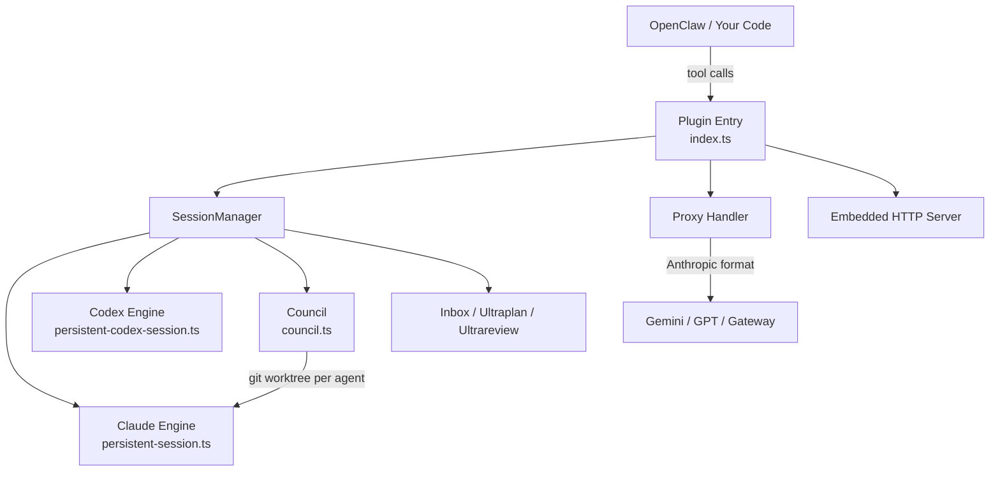

# openclaw-claude-code

Programmable bridge that turns coding CLIs into headless, agentic engines — persistent sessions, multi-engine orchestration, multi-agent council, and dynamic runtime control.

[](https://www.npmjs.com/package/@enderfga/openclaw-claude-code)
[](https://github.com/Enderfga/openclaw-claude-code/actions/workflows/ci.yml)
[](https://github.com/Enderfga/openclaw-claude-code/actions/workflows/ci.yml)
[](https://opensource.org/licenses/MIT)

## Why This Exists

Claude Code and Codex are powerful coding CLIs, but they're designed for interactive use. If you want AI agents to **programmatically** drive coding sessions — start them, send tasks, manage context, coordinate teams, switch models mid-conversation — you need a control layer.

This project wraps coding CLIs and exposes their capabilities as a clean, tool-based API. Your agents get persistent sessions, real-time streaming, multi-model routing, multi-engine support, and multi-agent council orchestration.

> **Why not just use the Claude API directly?** The API gives you completions. This gives you a fully managed coding agent — file editing, tool use, git awareness, context management, and multi-turn conversations — all without building the orchestration yourself.

## Quick Start

```bash
# As OpenClaw plugin (--dangerously-force-unsafe-install is required
# because this plugin spawns CLI subprocesses via child_process)
openclaw plugins install @enderfga/openclaw-claude-code --dangerously-force-unsafe-install

# Or standalone (no flag needed)
npm install -g @enderfga/openclaw-claude-code
claude-code-skill serve
```

```typescript
import { SessionManager } from '@enderfga/openclaw-claude-code';

const manager = new SessionManager();
await manager.startSession({ name: 'task', cwd: '/project' });
const result = await manager.sendMessage('task', 'Fix the failing tests');
```

See [Getting Started](./docs/getting-started.md) for full setup guide.

## Features

### Multi-Engine Sessions

Drive Claude Code and OpenAI Codex through a unified `ISession` interface. Each engine manages its own subprocess, events, and cost tracking.

```typescript
// Claude Code engine (default)
await manager.startSession({ name: 'claude-task', engine: 'claude', model: 'opus' });

// Codex engine
await manager.startSession({ name: 'codex-task', engine: 'codex', model: 'o4-mini' });
```

See [Multi-Engine](./docs/multi-engine.md) for architecture and adding new engines.

### Multi-Agent Council

Multiple agents collaborate in parallel on the same codebase with git worktree isolation, consensus voting, and a two-phase protocol (plan then execute).

```typescript
const session = manager.councilStart('Build a REST API with auth', {
  agents: [
    { name: 'Architect', emoji: '🏗️', persona: 'System design', engine: 'claude', model: 'opus' },
    { name: 'Engineer', emoji: '⚙️', persona: 'Implementation', engine: 'codex', model: 'o4-mini' },
    { name: 'Reviewer', emoji: '🔍', persona: 'Code review', engine: 'claude', model: 'sonnet' },
  ],
  maxRounds: 10,
  projectDir: '/tmp/api-project',
});
```

See [Council](./docs/council.md) for the full collaboration protocol.

### 24 Tools

| Category | Tools |
|----------|-------|
| Session Lifecycle | `claude_session_start`, `send`, `stop`, `list`, `overview` |
| Session Operations | `status`, `grep`, `compact`, `update_tools`, `switch_model` |
| Inbox | `session_send_to`, `session_inbox`, `session_deliver_inbox` |
| Agent Teams | `agents_list`, `team_list`, `team_send` |
| Council | `council_start`, `council_status`, `council_abort`, `council_inject` |
| Ultraplan | `ultraplan_start`, `ultraplan_status` |
| Ultrareview | `ultrareview_start`, `ultrareview_status` |

See [Tools Reference](./docs/tools.md) for complete API.

### Session Inbox

Cross-session messaging: sessions can send messages to each other. Idle sessions receive immediately; busy sessions queue for later delivery.

```typescript
await manager.sessionSendTo('planner', 'coder', 'The auth module needs rate limiting');
await manager.sessionSendTo('monitor', '*', 'Build failed!');  // broadcast
```

### Ultraplan

Dedicated Opus planning session that explores your project for up to 30 minutes and produces a detailed implementation plan.

```typescript
const plan = manager.ultraplanStart('Add OAuth2 support with Google and GitHub providers', {
  cwd: '/project',
});
// Poll: manager.ultraplanStatus(plan.id)
```

### Ultrareview

Fleet of 5-20 bug-hunting agents that review your codebase in parallel, each from a different angle (security, performance, logic, types, etc.).

```typescript
const review = manager.ultrareviewStart('/project', {
  agentCount: 10,
  maxDurationMinutes: 15,
});
// Poll: manager.ultrareviewStatus(review.id)
```

### And More

- **Session Persistence** — 7-day disk TTL, auto-resume across restarts
- **Multi-Model Proxy** — Anthropic ↔ OpenAI format translation for Gemini/GPT
- **Cost Tracking** — per-model pricing with real-time token accounting
- **Effort Control** — `low` to `max` thinking depth per message
- **Runtime Model/Tool Switching** — hot-swap via `--resume`

## Architecture



```
src/
├── index.ts                    # Plugin entry — 24 tools + proxy route
├── types.ts                    # Shared types, ISession interface, model pricing
├── persistent-session.ts       # Claude Code engine (ISession)
├── persistent-codex-session.ts # Codex engine (ISession)
├── session-manager.ts          # Multi-session orchestration + council management
├── council.ts                  # Multi-agent council orchestration
├── consensus.ts                # Consensus vote parsing
├── embedded-server.ts          # HTTP server for standalone mode
├── hooks/
│   └── prompt-bypass.ts
└── proxy/
    ├── handler.ts              # Provider detection + routing
    ├── anthropic-adapter.ts    # Anthropic ↔ OpenAI conversion
    ├── schema-cleaner.ts       # Gemini schema compatibility
    └── thought-cache.ts        # Gemini thought caching
```

## Documentation

| Doc | Description |
|-----|-------------|
| [Getting Started](./docs/getting-started.md) | Installation, configuration, first session |
| [Sessions](./docs/sessions.md) | Persistent sessions, resume, model switching, cost tracking |
| [Session Inbox](./docs/inbox.md) | Cross-session messaging |
| [Multi-Engine](./docs/multi-engine.md) | Claude + Codex engines, ISession interface, adding engines |
| [Council](./docs/council.md) | Multi-agent collaboration, worktree isolation, consensus voting |
| [Ultraplan & Ultrareview](./docs/ultra.md) | Deep planning and fleet code review |
| [Tools Reference](./docs/tools.md) | Complete tool API (24 tools) |
| [CLI Reference](./docs/cli.md) | Command-line interface |
| [Contributing](./CONTRIBUTING.md) | Dev setup, code style, PR guidelines |

## Requirements

- **Node.js >= 22**
- **Claude Code CLI** — `npm install -g @anthropic-ai/claude-code`
- **OpenClaw >= 2026.3.0** (optional, for plugin mode)
- **Codex CLI** (optional) — `npm install -g @openai/codex`

## License

MIT
