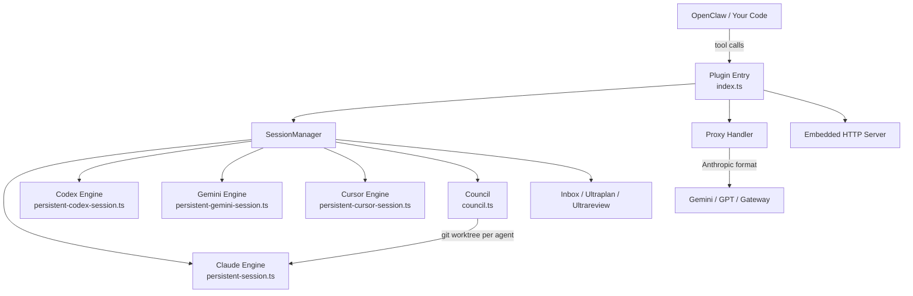

<p align="center">
  
</p>

# openclaw-claude-code

Programmable bridge that turns coding CLIs into headless, agentic engines — persistent sessions, multi-engine orchestration, multi-agent council, and dynamic runtime control.

[](https://www.npmjs.com/package/@enderfga/openclaw-claude-code)
[](https://github.com/Enderfga/openclaw-claude-code/actions/workflows/ci.yml)
[](https://github.com/Enderfga/openclaw-claude-code/actions/workflows/ci.yml)
[](https://opensource.org/licenses/MIT)

## Why This Exists

Claude Code and Codex are powerful coding CLIs, but they're designed for interactive use. If you want AI agents to **programmatically** drive coding sessions — start them, send tasks, manage context, coordinate teams, switch models mid-conversation — you need a control layer.

This project wraps coding CLIs and exposes their capabilities as a clean, tool-based API. Your agents get persistent sessions, real-time streaming, multi-model routing, multi-engine support, and multi-agent council orchestration.

> **Why not just use the Claude API directly?** The API gives you completions. This gives you a fully managed coding agent — file editing, tool use, git awareness, context management, and multi-turn conversations — all without building the orchestration yourself.

## Quick Start

```bash
# As OpenClaw plugin (--dangerously-force-unsafe-install is required
# because this plugin spawns CLI subprocesses via child_process)
openclaw plugins install @enderfga/openclaw-claude-code --dangerously-force-unsafe-install

# Or standalone (no flag needed)
npm install -g @enderfga/openclaw-claude-code
claude-code-skill serve
```

```typescript
import { SessionManager } from '@enderfga/openclaw-claude-code';

const manager = new SessionManager();
await manager.startSession({ name: 'task', cwd: '/project' });
const result = await manager.sendMessage('task', 'Fix the failing tests');
```

See [Getting Started](./skills/references/getting-started.md) for full setup guide.

## Features

### Multi-Engine Sessions

Drive Claude Code, OpenAI Codex, Google Gemini, and Cursor Agent through a unified `ISession` interface. Each engine manages its own subprocess, events, and cost tracking.

```typescript
// Claude Code engine (default)
await manager.startSession({ name: 'claude-task', engine: 'claude', model: 'opus' });

// Codex engine
await manager.startSession({ name: 'codex-task', engine: 'codex', model: 'o4-mini' });

// Gemini engine
await manager.startSession({ name: 'gemini-task', engine: 'gemini', model: 'gemini-pro' });

// Cursor Agent engine
await manager.startSession({ name: 'cursor-task', engine: 'cursor', model: 'sonnet-4' });
```

See [Multi-Engine](./skills/references/multi-engine.md) for architecture and adding new engines.

### Multi-Agent Council

Multiple agents collaborate in parallel on the same codebase with git worktree isolation, consensus voting, and a two-phase protocol (plan then execute).

```typescript
const session = manager.councilStart('Build a REST API with auth', {
  agents: [
    { name: 'Architect', emoji: '🏗️', persona: 'System design', engine: 'claude', model: 'opus' },
    { name: 'Engineer', emoji: '⚙️', persona: 'Implementation', engine: 'codex', model: 'o4-mini' },
    { name: 'Reviewer', emoji: '🔍', persona: 'Code review', engine: 'claude', model: 'sonnet' },
  ],
  maxRounds: 10,
  projectDir: '/tmp/api-project',
});
```

See [Council](./skills/references/council.md) for the full collaboration protocol.

### 27 Tools

| Category | Tools |
|----------|-------|
| Session Lifecycle | `claude_session_start`, `send`, `stop`, `list`, `overview` |
| Session Operations | `status`, `grep`, `compact`, `update_tools`, `switch_model` |
| Inbox | `session_send_to`, `session_inbox`, `session_deliver_inbox` |
| Agent Teams | `agents_list`, `team_list`, `team_send` |
| Council | `council_start`, `council_status`, `council_abort`, `council_inject`, `council_review`, `council_accept`, `council_reject` |
| Ultraplan | `ultraplan_start`, `ultraplan_status` |
| Ultrareview | `ultrareview_start`, `ultrareview_status` |

See [Tools Reference](./skills/references/tools.md) for complete API.

### Session Inbox

Cross-session messaging: sessions can send messages to each other. Idle sessions receive immediately; busy sessions queue for later delivery.

```typescript
await manager.sessionSendTo('planner', 'coder', 'The auth module needs rate limiting');
await manager.sessionSendTo('monitor', '*', 'Build failed!');  // broadcast
```

### Ultraplan

Dedicated Opus planning session that explores your project for up to 30 minutes and produces a detailed implementation plan.

```typescript
const plan = manager.ultraplanStart('Add OAuth2 support with Google and GitHub providers', {
  cwd: '/project',
});
// Poll: manager.ultraplanStatus(plan.id)
```

### Ultrareview

Fleet of 5-20 bug-hunting agents that review your codebase in parallel, each from a different angle (security, performance, logic, types, etc.).

```typescript
const review = manager.ultrareviewStart('/project', {
  agentCount: 10,
  maxDurationMinutes: 15,
});
// Poll: manager.ultrareviewStatus(review.id)
```

### And More

- **Session Persistence** — 7-day disk TTL, auto-resume across restarts
- **Multi-Model Proxy** — Anthropic ↔ OpenAI format translation for Gemini/GPT
- **Cost Tracking** — per-model pricing with real-time token accounting
- **Effort Control** — `low` to `max` thinking depth per message
- **Runtime Model/Tool Switching** — hot-swap via `--resume`

## Architecture



```
src/
├── index.ts                    # Plugin entry — 27 tools + proxy route
├── types.ts                    # Shared types, ISession interface, model pricing
├── constants.ts                # Shared constants (timeouts, limits, thresholds)
├── persistent-session.ts       # Claude Code engine (ISession)
├── persistent-codex-session.ts # Codex engine (ISession)
├── persistent-gemini-session.ts # Gemini engine (ISession)
├── persistent-cursor-session.ts # Cursor Agent engine (ISession)
├── session-manager.ts          # Multi-session orchestration + council management
├── council.ts                  # Multi-agent council orchestration
├── consensus.ts                # Consensus vote parsing
├── embedded-server.ts          # HTTP server for standalone mode
└── proxy/
    ├── handler.ts              # Provider detection + routing
    ├── anthropic-adapter.ts    # Anthropic ↔ OpenAI conversion
    ├── schema-cleaner.ts       # Gemini schema compatibility
    └── thought-cache.ts        # Gemini thought caching

skills/
├── SKILL.md                    # OpenClaw skill definition (triggers + metadata)
└── references/                 # All documentation (progressive disclosure)
    ├── getting-started.md      # Installation, configuration, first session
    ├── sessions.md             # Persistent sessions, resume, cost tracking
    ├── multi-engine.md         # Claude + Codex + Gemini engines
    ├── council.md              # Multi-agent collaboration protocol
    ├── tools.md                # Complete 27-tool API reference
    ├── inbox.md                # Cross-session messaging
    ├── ultra.md                # Ultraplan & Ultrareview
    └── cli.md                  # Command-line interface
```

## Documentation

All documentation lives in [`skills/references/`](./skills/references/) — see the directory tree above. Start with [Getting Started](./skills/references/getting-started.md), or jump to the [Tools Reference](./skills/references/tools.md) for the full 27-tool API.

For contributing: see [CONTRIBUTING.md](./CONTRIBUTING.md).

## Engine Compatibility

All engines are tested and verified in each release:

| Engine | CLI | Tested Version | Invocation | Status |
|--------|-----|---------------|------------|--------|
| Claude Code | `claude` | 2.1.91 | Persistent subprocess, stream-json | **Fully supported** |
| OpenAI Codex | `codex` | 0.118.0 | `codex exec --full-auto`, per-message | **Fully supported** |
| Google Gemini | `gemini` | 0.36.0 | `gemini -p --output-format stream-json`, per-message | **Fully supported** |
| Cursor Agent | `agent` | 2026.03.30 | `agent -p --force --output-format stream-json`, per-message | **Fully supported** |

> **Note:** CLI versions evolve independently. If a new CLI version changes its flags or output format, the plugin may need an update. Pin your CLI versions in CI to avoid surprises.

### Known Limitations

- **Team tools** (`team_list`, `team_send`) work on all engines: Claude uses native agent teams; Codex/Gemini/Cursor use cross-session messaging as a virtual team layer
- **Codex/Gemini/Cursor sessions** are one-shot per message (no persistent subprocess) — context is carried via working directory, not conversation history
- **Council consensus** requires agents to output an explicit `[CONSENSUS: YES/NO]` tag — loose phrasing will default to NO
- **Inbox delivered messages** are not retained in inbox history (only queued messages appear)

## Requirements

- **Node.js >= 22**
- **Claude Code CLI >= 2.1** — `npm install -g @anthropic-ai/claude-code`
- **OpenClaw >= 2026.3.0** (optional, for plugin mode)
- **Codex CLI >= 0.112** (optional) — `npm install -g @openai/codex`
- **Gemini CLI >= 0.35** (optional) — `npm install -g @google/gemini-cli`
- **Cursor Agent CLI** (optional) — Install via Cursor IDE or `curl https://cursor.com/install -fsSL | bash`

## License

MIT
